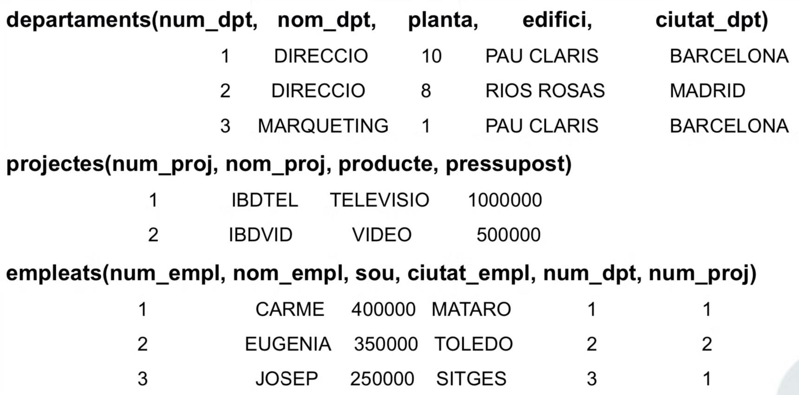

# Llenguatge SQL

SQL és un llenguatge estructurat de definició, actualització i consulta de bases de dades.

- És un llenguatge estàndard, tot i que els diferents constructors de SGBDR ofereixen variant de SQL.

# Introducció - Conceptes bàsics.

Una base de dades relacional està composta de Taules (Relacions) amb un conjunt de Columnes (Atributs) i un conjunt de Files (Tuples).



## Clau primaria:

Cada taula te una clau primaria que permet identificar cada fila de la taula. En l’exemple anterior **num_dpt** és la clau primaria de la taula *departaments*. De la mateixa manera, **num_proj** ho és a la taula *projectes*.

Així doncs, cada departament te un **num_dpt** únic, és a dir, que mai no existiran dos departament amb el mateix **num_dpt**.

## Clau forana:

Permet relacionar les files de dues taules diferents. En l’exemple d’abans **num_dpt** és clau forana de la taula *empleats* que referencia la taula *departaments*. Així doncs, entre les dades d’un empleat es trobarà el departament al que pertany, cosa que ens permet saber a quin departament treballa i qui treballa a cada departament.

# Creació d’una taula

```sql
CREATE TABLE <table> (
	<row_name> <data_type> [constrain], -- Pots afegir més coses com restriccions, etc.
	<row_name> <data_type> [constrain], 
	...
[<table_restrictions>]);
```

En crear una taula, podem afegir més informació a la fila per tal d’afegir restriccions i/o valors per defecte.

```sql
CREATE TABLE <table> (
	<row_name> <data_type> [<column_restrictions>][<default_value>]
);
```

- **data_type:** `INTEGER` `FLOAT(precision)` `REAL` `CHAR(n)` `NUMERIC(precision,scale)` `DECIMAL(precision,scale)` `SMALLINT` `DOUBLE PRECISION` `VARCHAR(n)` `DATE` …
- **default_value:**  Valor per defecte d’una columna per una fila que s’insereix a la taula.
    
    `DEFAULT{<literal> | NULL}` 
    
- **column_restrictions:**
    
    `UNIQUE` : La columna no pot tenir valors repetits
    
    `PRIMARY KEY` : La columna és clau primaria de la taula
    
    `REFERENCES <table> [col]` : La columna és clau forana que referencia a la taula indicada.
    
    `CHECK(<conditions>)` : La columna ha de complir les condicions especificades, només pot referirse a la columna per la que es defineix.
    
    `NOT NULL` : La columna no pot tenir valors nuls.
    

<aside>
⚠️ Les restriccions de columna fan referencia únicament a una columna. Per exemple un CHECK no pot fer referencia a més d’una columna.

</aside>

- **table_restrictions:**
    
    `UNIQUE([columns])` :  El conjunt de columnes seleccionades han de tenir valors únics entre files de la taula.
    
    `PRIMARY KEY([columns])` : El conjunt de les columnes especificades forman la clau primària.
    
    `FOREIGN KEY([columns]) REFERNCES <table> [columns]` : El conjunt de columnes especificades formen una clau forana que referencia la taula indicada.
    
    `CHECK(<conditions>)` : La taula ha de complir les condicions especificades. Pot referir-se a una o més columnes de la taula.
    

<aside>
⚠️ Les restriccions de la taula poden referirse a mes d’una columna. Així doncs, en cas de restriccions que tenen a veure amb més d’una columna cal usar restriccions de taula.

</aside>

**Veiem un exemple de creació de taula:**

```sql
CREATE TABLE empleats ( 
	num_empl INTEGER,
	nom_empl CHAR(30) NOT NULL,
	sou INTEGER DEFAULT 100000
	CHECK (sou>80000),
	ciutat_empl CHAR(30),
	num_dpt INTEGER,
	num_proj INTEGER,
PRIMARY KEY (num_empl),
FOREIGN KEY (num_dpt) REFERENCES departaments(num_dpt),
FOREIGN KEY (num_proj) REFERENCES projectes(num_proj));
```

# Inserció de files en una taula

```sql
INSERT INTO <table> [([columns])]
VALUES {(<value1>|NULL), (<value2>|NULL), ... , (<valuen>|NULL)} | <consulta>;
```

- En cas de no especificar `[columns]` els valors hauran de ser exactament amb les columnes i amb el mateix ordre.
- Pel contrari, si especifiquem quines columnes els valors han de correspondre a les columnes especificades en el mateix ordre.
- Els valors de les columnes de la fila es poden obtenir tambe com a resultat d’una consulta (ho veurem més endavant).

**Veiem un parell d’exemples d’inserció de files:**

```sql
INSERT INTO empleats
VALUES (4, 'RICARDO', 400000, 'BARCELONA', 1, 1);

INSERT INTO empleats (num_empl, num_dpt, num_proj, nom_empl)
VALUES (11, 3, 2, 'NURIA');
```

> Un cop vist el codi, la base de dades quedarà de la següent manera:
> 

| num_empl | nom_empl | sou | ciutat_empl | num_dpt | num_proj |
| --- | --- | --- | --- | --- | --- |
| 1 | JOSE | 300000 | BADALONA | 1 | 1 |
| 2 | MARTA | 440000 | TARRAGONA | 3 | 1 |
| 4 | RICARDO | 400000 | BARCELONA | 1 | 1 |
| 11 | NURIA | 100000 | NULL | 3 | 2 |

<aside>
💡

Cal observar que aquelles columnes a les que no hem especificat quin valor tenia, o bé s’han assignat a NULL, o pel contrari s’han assignat al valor predeterminat que vam definir en dita columna a l’hora de la seva creació dins la taula.

</aside>

# Esborrat de files d’una taula

```sql
DELETE FROM <table>
WHERE <conditions>;
```

S’eliminaràn de la taula totes aquelles files que compleixin les condicions especificades al `WHERE` 

**Veiem un exemple per tal d’entendre millor:**

```sql
DELETE FROM empleats
WHERE num_proj=4; -- BERNAT

DELETE FROM empleats
WHERE sou >= 400000; -- RICARDO, MARTA
```

| num_empl | nom_empl | sou | ciutat_empl | num_dpt | num_proj |
| --- | --- | --- | --- | --- | --- |
| 1 | JOSE | 300000 | BADALONA | 1 | 1 |
| 2 | MARTA | 440000 | TARRAGONA | 3 | 1 |
| 4 | RICARDO | 400000 | BARCELONA | 1 | 1 |
| 11 | NURIA | 100000 | NULL | 3 | 2 |
| 12 | BERNAT | 110000 | TARRAGONA | 2 | 4 |

# Modificació de files d’una taula

```sql
UPDATE <table>
SET <column> = {expresion | NULL}
-- Podem modificar diverses columnes en una sola sentencia set de la següent
-- manera: <column1> = {expresion | NULL}, <column2> = {expresion | NULL}, ...
WHERE <conditions>
```

Com podem deduir, es modificaran les columnes espeficicades d’aquelles files que compleixin les condicions imposades.

**Veiem diversos exemples per esclarir el funcionament:**

```sql
UPDATE empleats
SET sou = sou + 10000
WHERE num_proj = 1; -- JOSE, MARTA, RICARDO

UPDATE empleats
SET num_dpt = 4, ciutat_empl = 'GUISSONA'
WHERE num_empl = 11; -- NURIA
```

| num_empl | nom_empl | sou | ciutat_empl | num_dpt | num_proj |
| --- | --- | --- | --- | --- | --- |
| 1 | JOSE | 310000 | BADALONA | 1 | 1 |
| 2 | MARTA | 410000 | TARRAGONA | 3 | 1 |
| 4 | RICARDO | 410000 | BARCELONA | 1 | 1 |
| 11 | NURIA | 100000 | VIC | 4 | 2 |
| 12 | BERNAT | 110000 | TARRAGONA | 2 | 4 |

# Consultes sobre una taula

```sql
SELECT [columns] | *
FROM <table>
WHERE <conditions> -- OPCIONAL!!!
```

El resultat de la consulta es el valor de les columnes de la taula seleccionada d’aquelles files que cumpleixin amb les condicions imposades a la sentencia `WHERE` .

<aside>
💡

En cas de no afegir una sentencia **WHERE** especificant les condicions, com és lògic, el que obtindrem serà el valor de les columnes seleccionades per a totes les files de la taula.

</aside>

<aside>
💡

Per altra banda, en cas d’usar ***** en lloc d’especificar quines columnes volem seleccionar, ens estarem referint a que volem totes les columnes de la taula.

</aside>

**Ara doncs, veiem exemples:**

```sql
SELECT *
FROM empleats;
```

| num_empl | nom_empl | sou | ciutat_empl | num_dpt | num_proj |
| --- | --- | --- | --- | --- | --- |
| 1 | JOSE | 310000 | BADALONA | 1 | 1 |
| 2 | MARTA | 410000 | TARRAGONA | 3 | 1 |
| 4 | RICARDO | 410000 | BARCELONA | 1 | 1 |
| 11 | NURIA | 100000 | VIC | 4 | 2 |
| 12 | BERNAT | 110000 | TARRAGONA | 2 | 4 |

```sql
SELECT num_empl, nom_empl, sou
FROM empleats;
```

| num_empl | nom_empl | sou | ciutat_empl | num_dpt | num_proj |
| --- | --- | --- | --- | --- | --- |
| 1 | JOSE | 310000 | BADALONA | 1 | 1 |
| 2 | MARTA | 410000 | TARRAGONA | 3 | 1 |
| 4 | RICARDO | 410000 | BARCELONA | 1 | 1 |
| 11 | NURIA | 100000 | VIC | 4 | 2 |
| 12 | BERNAT | 110000 | TARRAGONA | 2 | 4 |

```sql
SELECT num_empl, nom_empl, sou
FROM empleats;
WHERE num_dpt = 1;
```

| num_empl | nom_empl | sou | ciutat_empl | num_dpt | num_proj |
| --- | --- | --- | --- | --- | --- |
| 1 | JOSE | 310000 | BADALONA | 1 | 1 |
| 2 | MARTA | 410000 | TARRAGONA | 3 | 1 |
| 4 | RICARDO | 410000 | BARCELONA | 1 | 1 |
| 11 | NURIA | 100000 | VIC | 4 | 2 |
| 12 | BERNAT | 110000 | TARRAGONA | 2 | 4 |

## Operadors en les condicions

- **Aritmètics:** `*` `+` `-` `/`
- **De comparació:** `=` `<` `>` `<=` `>=` `<>`
    
    L’operador `<>` ve a ser el mateix que `!=` no obstant es el primer qui esta definit com a estàndard.
    
- **Lògics:** `NOT` `AND` `OR`
- **Altres:**
    - `<column> BETWEEN <limit1> AND <limit2>`
    - `<column> IN <value1>, <value2>, ...`
    - `<column> IS NULL`
    - `<column> IS NOT NULL`
    - `<column> LIKE <characteristic>`
        
        ```sql
        WHERE CustomerName LIKE 'a%'	
        -- Finds any values that start with "a"
        WHERE CustomerName LIKE '%a'	
        -- Finds any values that end with "a"
        WHERE CustomerName LIKE '%or%'	
        -- Finds any values that have "or" in any position
        WHERE CustomerName LIKE '_r%'	
        -- Finds any values that have "r" in the second position
        WHERE CustomerName LIKE 'a__%'	
        -- Finds any values that start with "a" and are at least 3 characters in length
        WHERE ContactName LIKE 'a%o'	
        -- Finds any values that start with "a" and ends with "o"
        ```
        

Aquests operadors poden sortir a les condicions:

- Clausula `WHERE` de les sentencies `DELETE` `UPDATE` `SELECT`
- Clausula `CHECK` de les sentencies de creacio d’una taula `CHECK TABLE`

**Veiem exemples de com usar-los:**

```sql
SELECT num_empl, nom_empl
FROM empleats
WHERE NOT(num_dpt = 2) AND
			ciutat_empl IN ('VIC', 'TARRAGONA', 'BADALONA') AND
			nom_empl LIKE '%A'; -- el seu nom acaba en 'A'
```

| num_empl | nom_empl | sou | ciutat_empl | num_dpt | num_proj |
| --- | --- | --- | --- | --- | --- |
| 1 | JOSE | 310000 | BADALONA | 1 | 1 |
| 2 | MARTA | 410000 | TARRAGONA | 3 | 1 |
| 4 | RICARDO | 410000 | BARCELONA | 1 | 1 |
| 11 | NURIA | 100000 | VIC | 4 | 2 |
| 12 | BERNAT | 110000 | TARRAGONA | 2 | 4 |

## Diverses maneres de rebre els resultats d’una consulta

Quan fem una consulta a una taula obtenim els resultats que hem seleccionat. Fins ara hem vist la manera sencilla de fer consultes, a continuació veurem altres maneres de rebre les dades de consulta com poden ser: ordenades, sense repeticions, etc.

## Ordenació

```sql
SELECT [columns] | *
FROM <table>
WHERE <conditions> -- OPCIONAL
ORDER BY <column> [DESC | ASC];Com a resultat s’obte les dades ordenades segons les columnes especificades a la clausula `ORDER BY` 
```

- En cas de no especificar `DESC` (descendent) s’asumeix que es vol endreçar de manera ascendent, tot i que també podem esclarir-ho usant `ASC` .

<aside>
☝🏻

Podem triar diverses columnes per les que endreçar el resultat. Això servirà per exemple si vull endreçar per sou i, quan diversos empleats tinguin el mateix sou endreçar-los pel nom.

```sql
ORDER BY <column1> [DESC | ASC], <column2> [DESC | ASC], ...;
```

D’aquesta manera, `column1` es el primer criteri, `column2` el segon i així…

</aside>

**Veiem un exemple per tal de consolidar-ho:**

```sql
SELECT *
FROM empleats
WHERE num_dpt IN (1,3,4)
ORDER BY sou, nom_empl DESC; -- s'asumeix ASC per sou.
```

Aquesta seria la selecció:

| num_empl | nom_empl | sou | ciutat_empl | num_dpt | num_proj |
| --- | --- | --- | --- | --- | --- |
| 1 | JOSE | 310000 | BADALONA | 1 | 1 |
| 2 | MARTA | 410000 | TARRAGONA | 3 | 1 |
| 4 | RICARDO | 410000 | BARCELONA | 1 | 1 |
| 11 | NURIA | 100000 | VIC | 4 | 2 |
| 12 | BERNAT | 110000 | TARRAGONA | 2 | 4 |

El resultat el rebriem endreçat de la següent manera:

| num_empl | nom_empl | sou | ciutat_empl | num_dpt | num_proj |
| --- | --- | --- | --- | --- | --- |
| 11 | NURIA | 100000 | VIC | 4 | 2 |
| 1 | JOSE | 310000 | BADALONA | 1 | 1 |
| 4 | RICARDO | 410000 | BARCELONA | 1 | 1 |
| 2 | MARTA | 410000 | TARRAGONA | 3 | 1 |

<aside>
⚠️

Descendent lexicogràficament significa z, y, x, … , c, b, a.

</aside>

## Resultats sense repeticions

```sql
SELECT DISTINCT [columns]
FROM <table>
WHERE <conditions> -- <-- Opcional
```

- La paraula clau `DISTINCT` ens retorna el resultat sense repeticions.
- Si en lloc de `DISTINCT` usem `ALL` l’estariem solicita

```sql
SELECT nom_empl, sou
FROM empleats
WHERE sou >= 300000;
```

| num_empl | nom_empl | sou | ciutat_empl | num_dpt | num_proj |
| --- | --- | --- | --- | --- | --- |
| 11 | NURIA | 100000 | VIC | 4 | 2 |
| 1 | JOSE | 310000 | BADALONA | 1 | 1 |
| 4 | RICARDO | 410000 | BARCELONA | 1 | 1 |
| 2 | MARTA | 410000 | TARRAGONA | 3 | 1 |
| 5 | MARTA | 410000 | PONTEVEDRA | 5 | 3 |

La selecció de files sería aquesta, no obstant el resultat que obtindrem és el següent:

| nom_empl | sou |
| --- | --- |
| JOSE | 310000 |
| RICARDO | 410000 |
| MARTA | 410000 |

> Si observem, tenim dues files amb nom_empl = MARTA i sou = 410000, tot i així s’ha eliminat aquest duplicat. No importa quina de les dues “MARTA” està agafant, ja que no es la fila, sino les dades en si, MARTA i 410000.
> 

<aside>
💡

Realment el que esta pasant és que s’esta fent un recorregut per totes les files del resultat eliminant duplicats, per tant hem d’anar molt en compte amb l’ús que donem a `DISTINCT` i no abusar-ne.

**SELECCIÓ**

| nom_empl | sou |
| --- | --- |
| JOSE | 310000 |
| RICARDO | 410000 |
| MARTA | 410000 |
| MARTA | 410000 |

**RESULTAT**

| nom_empl | sou |
| --- | --- |
| JOSE | 310000 |
| RICARDO | 410000 |
| MARTA | 410000 |
</aside>

## Funcions d’agregació

Son funcions que s’apliquen sobre el conjunt de files de la taula a consultar que compleixen les condicions de la clausula `WHERE` (si es que la hem especificat).

```sql
SELECT <aggregate_functions>
FROM <table>
WHERE <conditions> -- OPCIONAL
```

- `COUNT()`: Serveix per comptar files de la taula especificada. Podem combinarlo amb arguments i condicions al `WHERE` per comptar aquelles que compleixen certa condició.
    - `COUNT(*)` Número de files que compleixin la condició del `WHERE`
    - `COUNT(<column>)` Número de valors no nuls de la columna de les files que compleixen la condició del `WHERE` (si és que hi ha).
    - `COUNT(DISTINCT <column>)` Número de valors (no nuls) diferents (no compta les repeticions) que compleixen la condició del `WHERE` (si és que hi ha).
- `SUM(expresion)` Dóna la **suma** dels valors resultants de calcular l’expressió per a cada fila.
- `MIN(expresion)` Dóna el **valor mínim** dels resultats de calcular l’expressió per a cada fila.
- `MAX(expresion)` Dóna el **valor màxim** dels resultats de calcular l’expressió per a cada fila.
- `AVG(expresion)` Dóna la mitja (valor promitg) dels resultants de calcular l’expressió per a cada fila.

<aside>
⚠️

A totes elles sels hi pot agregar la clausula `WHERE` la qual cosa fara que només s’apliqui dita funció a les files que compleixen la condició. Per exemple en el cas de la suma nomes sumarà els resultats de les files que compleixin el condicional.

</aside>

**Veiem un exemple per ilustrar-ho millor:**

```sql
SELECT
	COUNT(*) AS quantEmpl, -- Quantitat d'empleats que es troben al dpt 1 o 3
	COUNT(DISTINCT nom_empl) AS quantNoms, -- Nombre d'empleats amb noms diferents al dpt 1 i 3
	SUM(sou*0.1) AS partSou -- Suma del 10% del sou dels empeats del dpt 1 i 3.
FROM empleats
WHERE num_dpt IN (1,3);
```

Aquestes son les files seleccionades:

| num_empl | nom_empl | sou | ciutat_empl | num_dpt | num_proj |
| --- | --- | --- | --- | --- | --- |
| 1 | JOSE | 310000 | BADALONA | 1 | 1 |
| 11 | NURIA | 100000 | VIC | 4 | 2 |
| 4 | RICARDO | 410000 | BARCELONA | 1 | 1 |
| 2 | MARTA | 410000 | TARRAGONA | 3 | 1 |
| 5 | MARTA | 410000 | PONTEVEDRA | 1 | 3 |

El resultat és el següent:

| quantEmpl | quantNoms | partSous |
| --- | --- | --- |
| 4 | 3 | 154000 |

<aside>
💡

Si ens fixem la manera en la que s’incorporen els resultats de les funcions d’agregació al resultat de la consulta es sota una mena de variable temporal.

`aggregate_function() AS result_name`

</aside>

## Group By

En ocasions és útil agrupar les dades en grups. Per exemple: en departaments, en ciutats… Els grups es fan segons les columnes que haguem determinat amb aquelles que tinguin el mateix valor. El resultat serà una fila amb les dades resultants per a cada grup.

<aside>
⚠️

El resultat de les columnes en dites agrupacións ha de ser un valor únic. Es a dir, no pot ser un resultat de varies dades.

❌ `select` nom `group by` persones que treballen a Barcelona 

✅ `select` salari promig `group by` persones que treballen a Barcelona

Observem doncs que es molt útil si ho combinem amb funcions d’agregació.

</aside>

Això, clarament, ho podem combinar amb la clausula `WHERE` fent així que els grups es fagin només amb aquelles files que compleixin la condició.

Per altra banda, la clausula `HAVING` funciona similar però aplicat als grups. Per exemple per dir que ens quedarem solament amb aquells grups que tinguin més de `x` files.

**A continuació, un exemple per esclarir els dubtes:**

```sql
SELECT num_dpt, SUM(sou) AS sum_sou
FROM empleats
WHERE sou > 10000
GROUP BY num_dpt -- agrupem als empleats per departament
HAVING COUNT(*) > 2 -- que tenen més d'un empleat
```

| num_empl | nom_empl | sou | ciutat_empl | num_dpt | num_proj |
| --- | --- | --- | --- | --- | --- |
| 1 | JOSE | 310000 | BADALONA | 1 | 1 |
| 11 | NURIA | 100000 | VIC | 4 | 2 |
| 4 | RICARDO | 410000 | BARCELONA | 1 | 1 |
| 2 | MARTA | 410000 | TARRAGONA | 3 | 1 |
| 5 | MARTA | 410000 | PONTEVEDRA | 1 | 3 |
| 6 | LUCAS | 30000 | PONTEVEDRA | 3 | 2 |

En aquesta ilustració veiem els grups que es generen en agrupar per departament.

| num_empl | nom_empl | sou | ciutat_empl | num_dpt | num_proj |
| --- | --- | --- | --- | --- | --- |
| 1 | JOSE | 310000 | BADALONA | 1 | 1 |
| 11 | NURIA | 100000 | VIC | 4 | 2 |
| 4 | RICARDO | 410000 | BARCELONA | 1 | 1 |
| 2 | MARTA | 410000 | TARRAGONA | 3 | 1 |
| 5 | MARTA | 410000 | PONTEVEDRA | 1 | 3 |
| 6 | LUCAS | 30000 | PONTEVEDRA | 3 | 2 |

La fila de la Nuria es descarta abans de fer tan sols els grups, per la clausula `WHERE` que estableix `sou > 10000` . Pel que fa al grup del departament 3, el descarta la clausula `HAVING` la qual estableix que el grup ha de tenir més de dues files (el departament ha de tenir més de dos empleats).

Pel que el resultat seria el següent: →

| num_dpt | sum_sou |
| --- | --- |
| 1 | 1130000 |

# Consultes sobre més d’una taula

```sql
SELECT [columns]
FROM [tables]
WHERE <condition> -- OPCIONAL
```

En quant a la sintaxi la variació es mínima no obstant, cal profunditzar una mica més sobre com funciona interament.

**Pel que fa a la sintaxi** trobarem que ja no ens referirem a les columnes solament pel seu nom, sino fent referencia a la taula de la que son:

```sql
SELECT empleats.nom_empl, departament.nom_dpt
FROM empleats, departaments
WHERE ...
-- en combinar dues taules podem fer condicionals que involucrin totes dues
```

També és molt popular l’ús d’alies per a les taules per tal que sigui més curt.

```sql
SELECT e.nom_empl, d.nom_dpt
FROM empleats e, departaments d
WHERE ...
```

**Pel que fa al funcionament** cal tenir en compte que quan fem consultes sobre més d’una taula el que estem fent es un **producte cartesia** entre les dues taules, es a dir que podriem considerar una la qual contempla totes les combinacións de les files d’una amb la de l’altre.

| id_empl | nom_empl | dpt |
| --- | --- | --- |
| 1 | Roberto | 2 |
| 2 | Lucía | 4 |

| id_dpt | nom_dpt |
| --- | --- |
| 2 | COMPRAS |
| 4 | MARKETING |

Considerant aquestes dues taules obtindriem:

| id_empl | nom_empl | dpt | id_dpt | nom_dpt |
| --- | --- | --- | --- | --- |
| 1 | Roberto | 2 | 2 | COMPRAS |
| 2 | Lucía | 4 | 2 | COMPRAS |
| 1 | Roberto | 2 | 4 | MARKETING |
| 2 | Lucía | 4 | 4 | MARKETING |

Normalment la intenció de convinar taules es ampliar l’informació d’una fila amb les seves relacions, en aquest cas lo logic sería veure la informació de l’empleat juntament amb la informació del departament al que pertany.

Per aixó lo lógic sería:

```sql
SELECT empleats.nom_empl, departaments.nom_dpt
FROM empleats, departaments
WHERE empleats.dpt = departaments.id_dpt -- <---
```

Per aixó mateix tenim sintaxis alternatives

- O bé usem la clausula `WHERE` com acabem de veure
- O bé usem la clausula `JOIN` al `FROM`
    - **INNER JOIN:** requereix la condició de combinació de manera
    explícita
    
    ```sql
    SELECT empleats.nom_empl, departaments.nom_dpt
    FROM empleats INNER JOIN departaments
    ON empleats.dpt = departaments.id_dpt -- <---
    ```
    
    - **NATURAL INNER JOIN:** fa la combinació per les columnes amb el
    mateix nom en les taules implicades.
    
    ```sql
    SELECT empleats.nom_empl, departaments.nom_dpt
    FROM empleats NATURAL INNER JOIN departaments
    ```
    

<aside>
💡

Si pensem la combinació de taules com a producte cartesia entre taules, podem aplicar tot lo vist fins ara amb la mateixa lògica, doncs al cap i a la fi estem operant una taula. (una de més gran però una taula).

</aside>

# Unió de consultes

```sql
SELECT [columns]
FROM [tables]
UNION
SELECT [columns]
FROM [tables]
```

El resultat és la unió del resultat obtingut de les dues sentències SELECT

<aside>
⚠️

El que es fà es que s’afegeixen els resultats del segon `SELECT` al resultat del primer, pel que el resultat del segon ha de ser del mateix “estil” que el primer.

Es a dir, si el primer son parells `(INTEGER, CHAR)` el segon també ho han de ser.

</aside>

**Veiem un exemple:**

```sql
SELECT ciutat_empl
FROM empleats
UNION
SELECT ciutat
FROM departaments
-- Podriem afegir una clausula WHERE
```

| ciutat_empl |
| --- |
| BARCELONA |
| TARRAGONA |
| MADRID |
| VALENCIA |

| num_empl | nom_empl | sou | ciutat_empl | num_dpt | num_proj |
| --- | --- | --- | --- | --- | --- |
| 1 | JOSE | 310000 | BARCELONA | 1 | 1 |
| 11 | NURIA | 100000 | MADRID | 4 | 2 |
| 4 | RICARDO | 410000 | BARCELONA | 1 | 1 |
| 2 | MARTA | 410000 | TARRAGONA | 3 | 1 |

| num_dpt | nom_dpt | planta | edifici | ciutat |
| --- | --- | --- | --- | --- |
| 1 | VENTAS | 3 | PAU CLARIS | BARCELONA |
| 2 | MARKETING | 1 | PASSEIG DE GRACIA | BARCELONA |
| 4 | DIRECCIÓ | 2 | GRAN VIA | MADRID |
| 3 | RRHH | 2 | PASSEIG MARITIM | VALENCIA |

Com veiem, el resultat es presenta com a `ciutat_empl` per tant si volem usar una clausula `ORDER BY` haurem de fer-ho segons les columnes del primer `SELECT` .

<aside>
⚠️

El resultat es presenta sense repeticions

</aside>

# Diferencia de consultes

Com be hem estat veient, SQL es basa en el concepte matemàtic de conjunts, pel que es natural poder fer una operació d’aquest estil amb les dades.

Hi han dues maneres de fer-ho: usant la clausula `NOT IN` o be `NOT EXISTS` 

## `NOT IN`

```sql
SELECT [columns]
FROM [tables]
WHERE <column_a> NOT IN (
	SELECT <column_b>
	FROM <table>
	WHERE <condition> -- OPCIONAL
);
```

Aquesta sintaxi la podem llegir com “selecciona aquelles files de la primera consulta les quals el valor de la columna `column_a` no es trobi entre el resultat de la segona consulta.

<aside>
⚠️

Novament cal notar que estem compartant una columna amb una subconsulta, per tant, aquesta subconsulta ha de retornar una única columna.

</aside>

**Veiem doncs un exemple:** On volem com a resultat aquells projectes que no tenen empleats assignats.

| num_proj | nom_proj |
| --- | --- |
| 1 | IBDTEL |
| 2 | IBDVID |
| 3 | IBDCOM |
| 4 | IBDTEF |

| num_empl | nom_empl | num_proj |
| --- | --- | --- |
| 1 | MARCOS | 1 |
| 2 | MARTA | 3 |
| 4 | JUAN | 3 |
| 3 | PEDRO | 1 |

```sql
SELECT projectes.num_proj, projectes.nom_proj
FROM projectes
WHERE projectes.num_proj NOT IN (
	SELECT empleats.num_proj
	FROM empleats
);
```

| num_proj | nom_proj |
| --- | --- |
| 2 | IBDVID |
| 4 | IBDTEF |

## `NOT EXISTS`

```sql
SELECT [columns]
FROM [tables]
WHERE NOT EXISTS (
	SELECT *
	FROM [tables]
	WHERE <conditions> -- OPCIONAL
);
```

En aquest cas, la fila serà part del resultat si no pertany a la segona consulta.

Cal destacar que, a diferencia de `NOT IN` al usar `NOT EXISTS` no cal que el resultat de la subconsulta sigui del mateix “estil” que la consulta externa, ja que el que comprova la clausula `EXISTS` és l’existencia de files. Per tant usem la condició del `WHERE` per a comprovar si les files compleixen la condició.

<aside>
⚠️

No importa el nombre de columnes i el tipus de dada, solament importa l’existencia de files.

</aside>

Així doncs, usant el `NOT` tindrem `true` quan no existeixin files que compleixin la condició.

**Veiem doncs l’exemple anterior, ara, amb aquesta sintaxi:**

```sql
SELECT projectes.num_proj, projectes.nom_proj
FROM projectes
WHERE NOT EXISTS (
	SELECT * FROM empleats
	WHERE empleats.num_proj = projectes.num_proj
);
```

Com podem veure, el que ens interesa son els projectes pels que no hi ha ningú assignat. Per tant, per cada fila de projectes, obtindrem `true` per aquelles per les que una consulta en la que busquem empleats amb dit nombre de projecte no existeixi. Fent així la diferencia que ens interessa.

# Subconsultes en sentències

Les subconsultes ens serveixen per, en aquelles sentencies on es trobi un `WHERE` actuar segons el resultat d’una subconsulta. Veurem la següent estructura:

```sql
STATEMENT [columns]
FROM [tables]
WHERE ... (
	-- SUBCONSULTA
);
```

Com observem, la subconsulta s’executa per cada fila de la consulta principal, és a dir, si fem una consulta de la taula projectes, amb una subconsulta a la taula empleats, per cada fila de la taula projectes farem una subconsulta a la taula empleats.

## Subconsultes en sentències `DELETE`

```sql
DELETE FROM <table>
WHERE ... (
	SELECT ...
);
```

Com veiem, la subconsulta sempre va al lloc de la condició.

**Veiem un exemple per il·lustrar-ho millor:** Volem eliminar totes aquelles files de la taula projectes les quals no tinguin a empleats asignats.

```sql
DELETE FROM projectes
WHERE NOT EXISTS (
	SELECT *
	FROM empleats
	WHERE empleats.num_proj = projectes.num_proj
);
```

Com observem, totes aquelles files de la taula projecte per les que no existeixi al menys una fila a empleats assignat al projecte seràn eliminades; doncs la consulta serà buida.

## Subconsultes en sentències `UPDATE`

```sql
UPDATE <table>
SET [columns]
WHERE ... (
	SELECT ...
);
```

Novament segueix una estructura similar a l’anterior, doncs la gracia resideix en que podem seguir usant les sentencies igual que ho feiem anteriorment, però, ens dona la llibertat de poder condicionar-les als resultats de consultes en altres taules.

**Veiem un exemple** on volem incrementar en un 10% el presupost de tots aquells projectes amb almenys dos empleats assignats.

```sql
UPDATE projectes
SET pressupost = pressupost + pressupost * 0.1
WHERE 2 <= (
	SELECT COUNT(*)
	FROM empleats
	WHERE empleats.num_project = projectes.num_project
);
```

| num_proj | nom_proj | pressupost |
| --- | --- | --- |
| 1 | IBDTEL | 110000 |
| 2 | IBDVID | 210000 |
| 3 | IBDCOM | 220000 |
| 4 | IBDTEF | 40000 |

| num_empl | nom_empl | num_proj |
| --- | --- | --- |
| 1 | MARCOS | 1 |
| 2 | MARTA | 3 |
| 4 | JUAN | 3 |
| 3 | PEDRO | 1 |

Com hem pogut veure a l’exemple, també podem usar les subconsultes per condicionar segons resultats obtinguts de funcións d’agregació.

## Subconsultes amb sentències `SELECT`

```sql
SELECT [columns]
FROM [tables]
WHERE ... (
	SELECT...
);
```

Altra vegada, l’estructura es la mateixa, aprofitarem aquesta secció per a **veure un exemple** on la subconsulta es sobre la mateixa taula que la consulta extena:

```sql
SELECT empleats.num_empl, empleats.nom_empleats
FROM empleats
WHERE empleats.sou > (
	SELECT AVG(empleats.sou)
	FROM empleats
);
```

Com observem, estem seleccionant aquells empleats els quals tinguin un sou major a la mitja de del sou de tots el empleats.

Cap destacar que podriem haver usat alies per a distingir la consulta interna de l’externa, no obstant en aquest cas no genera cap impacte.

## Subconsultes en secuències `INSERT`

```sql
INSERT INTO <table> (
	SELECT ...
);
```

Com és d’esperar, podem insertar el resultat d’una subconsulta a una altra taula.

<aside>
⚠️

Com és lògic les files d’una taula i l’altre han de ser del mateix estil és a dir, que si les files de la taula a la que insereixo son de l’estil `(INTEGER, CHAR, INTEGER)` el resultat de la subconsulta també ho ha de ser.

<aside>
💡

Podem fer un truc per a afegir dades que no hi siguin a les files seleccionades com ho veurem ara a l’exemple.

O bé especificar explicitament quines son les columnes que especificaré

```sql
INSERT INTO <table> (column1, column2, ...) (
	SELECT ...
);
```

D’aquesta manera el resultat de la selecció novament haurà de ser compatible amb les columnes especificades, en el mateix ordre.

</aside>

</aside>

**Veiem l’exemple:**

```sql
INSERT INTO encarregats ( -- te num_encarregat, nom, quantes persones a càrrec
	SELECT num_empl, nom_empl, 1 -- AQUEST 1 és la dada que estem afegint. (truc)
	FROM empleats
	WHERE sou >= 400000
);
```

| num_empl | nom_empl | sou | ciutat_empl | num_dpt | num_proj |
| --- | --- | --- | --- | --- | --- |
| 1 | JOSE | 310000 | BARCELONA | 1 | 1 |
| 11 | NURIA | 100000 | MADRID | 4 | 2 |
| 4 | RICARDO | 410000 | BARCELONA | 1 | 1 |
| 2 | MARTA | 410000 | TARRAGONA | 3 | 1 |

| num_encarr | nom_encarr | quantEmpl |
| --- | --- | --- |
| 4 | RICARDO | 1 |
| 2 | MARTA | 1 |

Com podem observar, s’ha insertat a la taula d’empleats el resultat de la subconsulta a empleats. Com hem vist hem afegit el valor `1` com a literal.

Altra manera de conseguir quelcom similar és especificant, com bé s’ha especificat a l’inici, quines columnes insertarem.

```sql
INSERT INTO encarregats (num_encarr, nom_encarr) (
	SELECT num_empl, nom_empl
	FROM empleats
	WHERE sou >= 400000
);
```

| num_encarr | nom_encarr | quantEmpl |
| --- | --- | --- |
| 4 | RICARDO | NULL |
| 2 | MARTA | NULL |

## Subconsultes en clausules `HAVING`

Com bé vam mencionar al introduïr la clausula `HAVING` aquesta es comporta de manera gairebé identica a la clausula `WHERE` amb la diferencia que `HAVING` és per triar grups, i no files.

Es per aixó que la manera d’introduïr subconsultes en `HAVING` és pràcticament identica a fer-ho en una clausula `WHERE` .

```sql
SELECT [columns]
FROM [tables]
WHERE <condition>
GROUP BY [columns]
HAVING ... (
	SELECT ...
);
```

**Veiem un exemple** on volem obtenir els departaments on el promig salarial dels integrants està per sobre del promig salarial del total d’empleats

```sql
SELECT d.num_dpt, d.nom_dpt, AVG(e_grup) as promig_dpt
FROM departaments d, empleats e_grup
WHERE d.num_dpt = e_grup.num_dpt
GROUP BY d.num_dpt
HAVING AVG(e_grup.sou) >= ( -- ens quedem amb els grups que tinguin promig
	SELECT AVG(e_tot.sou)     -- major al promig total
	FROM empleats e_tot
);
```

| num_empl | nom_empl | sou | num_dpt |
| --- | --- | --- | --- |
| 1 | JOSE | 310000 | 1 |
| 11 | NURIA | 100000 | 4 |
| 4 | RICARDO | 410000 | 1 |
| 2 | MARTA | 410000 | 3 |

**Promig_T = 307500**

Promig_1 = 360000

Promig_3 = 410000

Promig_4 = 100000

Tenint en compte les dades salarials dels empleats el resultat serà el seguent

| num_dpt | nom_dpt | promig_dpt |
| --- | --- | --- |
| 1 | VENTAS | 360000 |
| 3 |  RRHH | 410000 |